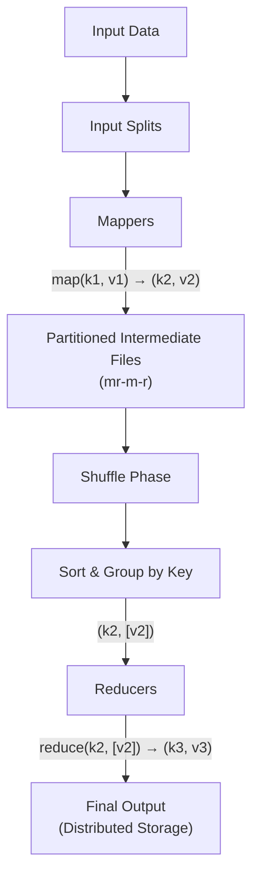

# Map Reduce

Idiomatic implementation of the famous map reduce [paper](https://static.googleusercontent.com/media/research.google.com/en//archive/mapreduce-osdi04.pdf)

## Core logic

### Map Function

$$\mathrm{map}(k_1, v_1) \to \mathrm{list}(k_2, v_2)$$

The map function processes an input key–value pair and emits zero or more intermediate key–value pairs.

### Reduce Function

$$\mathrm{reduce}(k_2, [v_2]) \to \mathrm{list}(k_3, v_3)$$

The reduce function aggregates all values associated with the same key and produces the final output.

---

## Preconditions

- Input data must be representable (or transformable) as key–value pairs.
- Intermediate and output data are also key–value pairs.
- The problem must be decomposable into independent map operations followed by associative aggregation.

---

## Input Splitting and Mappers

- Input data is divided into **input splits** (for example, 128MB blocks in HDFS).
- Each input split is processed by a single mapper.
- The number of mappers is determined by the number of input splits, not by the number of input files.

Each mapper:

1. Reads one input split
2. Applies the map function
3. Emits intermediate key–value pairs

### Example (Word Count)

Input split:

```

Mapper output:
(apple, 1)
(banana, 1)
```

---

## Partitioning and Intermediate Files

- Mapper output is partitioned using a deterministic partition function:

$$\text{partition} = \mathrm{hash}(\text{key}) \bmod \text{numReducers}$$

- Each mapper creates **one intermediate file per reducer**, not per key.

For `M` mappers and `R` reducers, mapper `m` produces:

$$\{\mathrm{mr}\text{-}m\text{-}r \mid r = 0,\dots,R-1\}$$

Each intermediate file contains multiple keys assigned to the same reducer.

---

## Shuffle and Sort Phase

After all mappers complete, the framework performs the **shuffle and sort** phase.

### Shuffle

- Each reducer fetches its partition from every mapper.
- Reducer `r` reads:

$$\{\mathrm{mr}\text{-}m\text{-}r \mid m = 0,\dots,M-1\}$$

### Sort

- The fetched data is merged and sorted by key.
- Values are grouped so reducers receive:

$$ (k_2, [v_2]) $$

---

## Reducers

Each reducer:

1. Reads all intermediate data assigned to it
2. Receives grouped and sorted key–value lists
3. Applies the reduce function for each key
4. Writes final output to distributed storage

### Example Reduce Step

$$\mathrm{reduce}(\text{apple}, [1,1,1,1]) \to (\text{apple}, 4)$$

---

## Storage and Data Locality

- Mapper outputs are written to local disks on mapper nodes.
- Reducers pull intermediate data over the network during shuffle.
- Final reducer output is written to a distributed filesystem (for example, HDFS).
- Data locality is an optimization, not a guarantee.

---

## End-to-End Flow (Mermaid Diagram)


